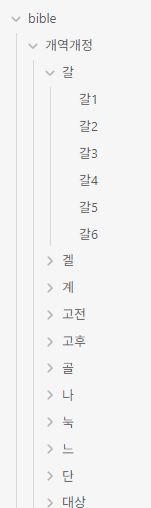
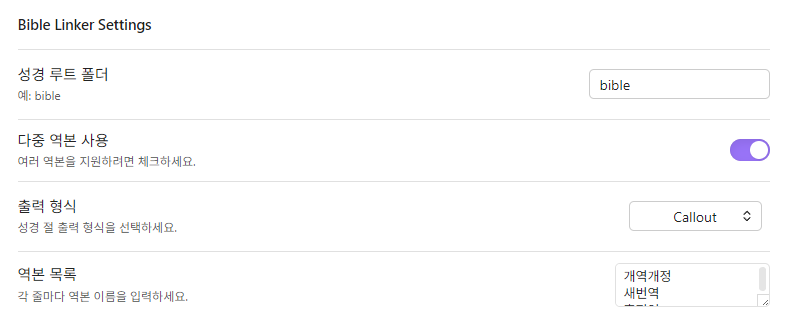
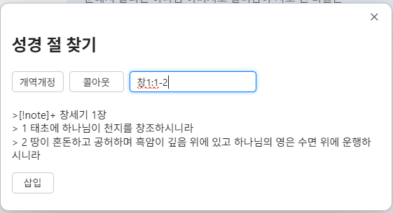
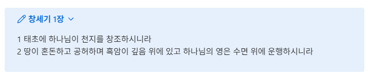

# Obsidian Bible Linker

-   for my self-version

I used the obsidian bible linker well, but it doesn't apply to me anymore, so I wrote it from scratch to suit my environment. It may be a bit lacking.

## Settings

1. folder settings
   
2. plugin settings
   
3. bible input
   
4. result
   

---

Setting rules

1. 성경 루트 폴더
    - This is the default folder with Bible files. If you are using multiple translations, please enter the root folder with each translation folder.
2. 다중 역본 사용
    - Please check if you use multiple copies.
3. 출력 형식
    - The output format is one line, cut, or call-out. Right now, we only support call-outs in the form of notes.
4. 역본 목록
    - For the list, you can write down the name of your copy folder. It will go up one space later.
